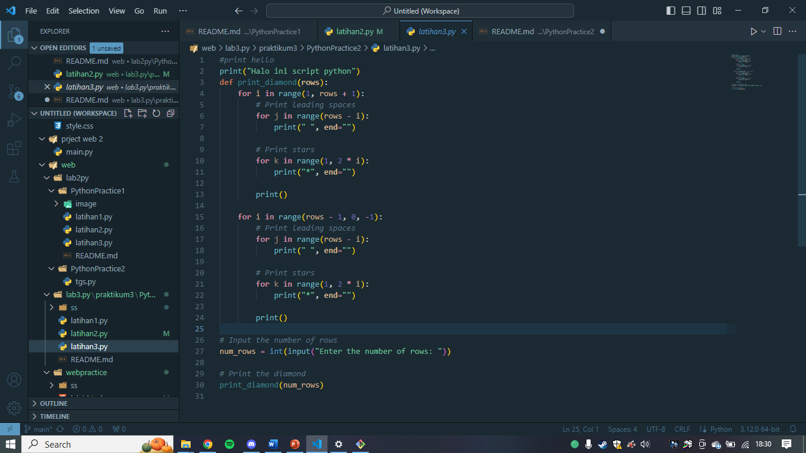
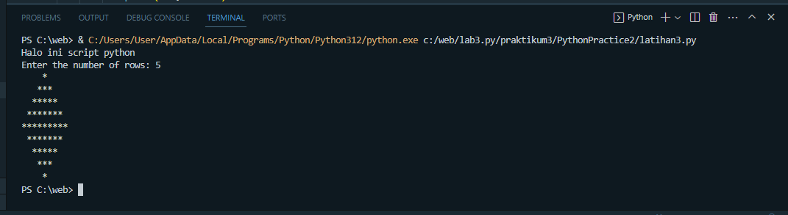

# PythonPractice2

* Latihan 1

* Latihan 2

**Input nilai**

Kode ini meminta pengguna untuk memasukkan dua nilai, a dan b, menggunakan fungsi input(). Nilai-nilai ini dimasukkan sebagai string.

**Input Variabel**

Ini mencetak nilai a dan b yang dimasukkan oleh pengguna.

**Hasil Penggabungan**

Kode ini mencoba menggabungkan nilai a dan b sebagai string menggunakan format().

**Konversi Nilai Variabel**

Kode ini mengonversi nilai a dan b dari string ke integer menggunakan fungsi int().

**Print Penjumlahan dan Pembagian**

Kode ini mencetak hasil penjumlahan dan pembagian dari nilai a dan b.

* Latihan 3

**Membuat Fungsi print_diamond**
Pertama-tama, kita mendefinisikan fungsi print_diamond yang akan mencetak pola berlian. Fungsi ini menerima satu parameter, yaitu jumlah baris dari berlian yang akan dicetak.

**Loop Pertama (Baris ke-atas)**
Kita menggunakan loop for untuk membuat pola dari atas ke bawah. Loop ini akan berjalan dari 1 hingga rows + 1.

**Leading Spaces (Spasi Awal**
Di dalam loop pertama, kita tambahkan loop untuk mencetak spasi sebelum bintang, berdasarkan posisi baris. Ini akan mencetak spasi dari rows - i.

**Bintang**
Kita tambahkan loop untuk mencetak bintang, yang akan mencetak bintang sebanyak 2 * i - 1.

**Pindah Baris**
Setelah mencetak spasi dan bintang di setiap baris, kita pindah ke baris baru.

**Loop Kedua (Baris ke-bawah):**
Selanjutnya, kita menggunakan loop for yang serupa untuk membuat pola dari bawah ke atas. Loop ini akan berjalan dari rows - 1 hingga 0.

**Leading Spaces (Spasi Awal) untuk Loop Kedua**
Seperti pada loop pertama, kita tambahkan loop untuk mencetak spasi sebelum bintang.

**Bintang untuk Loop Kedua**
Kita tambahkan loop untuk mencetak bintang, yang akan mencetak bintang sebanyak 2 * i - 1.

**Pindah Baris untuk Loop Kedua**
Setelah mencetak spasi dan bintang di setiap baris, kita pindah ke baris baru.

**Input Jumlah Baris**
 Di luar fungsi, kita minta pengguna untuk memasukkan jumlah baris yang diinginkan.

 **Memanggil Fungsi dan Mencetak Berlian**
  Terakhir, kita memanggil fungsi print_diamond dengan jumlah baris yang dimasukkan oleh pengguna.

  *INI OUTPUT*
  
  
