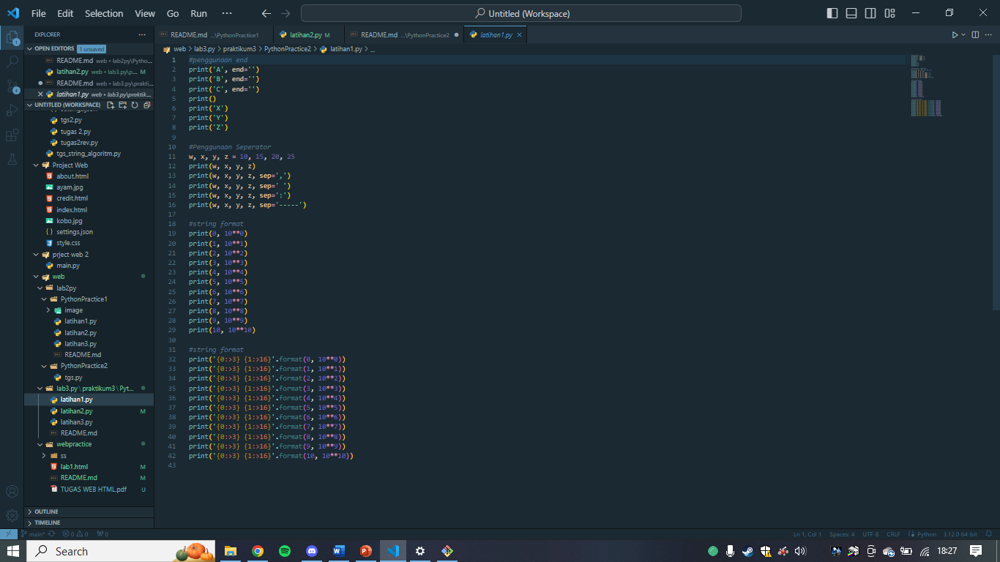
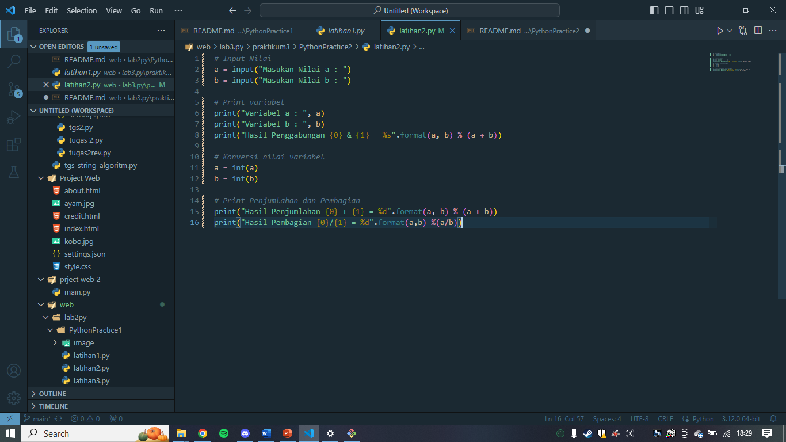

# PythonPractice2

* Latihan 1

* Latihan 2

Input nilai

Kode ini meminta pengguna untuk memasukkan dua nilai, a dan b, menggunakan fungsi input(). Nilai-nilai ini dimasukkan sebagai string.

Input Variabel

Ini mencetak nilai a dan b yang dimasukkan oleh pengguna.

Hasil Penggabungan

Kode ini mencoba menggabungkan nilai a dan b sebagai string menggunakan format().

Konversi Nilai Variabel

Kode ini mengonversi nilai a dan b dari string ke integer menggunakan fungsi int().

Print Penjumlahan dan Pembagian

Kode ini mencetak hasil penjumlahan dan pembagian dari nilai a dan b.